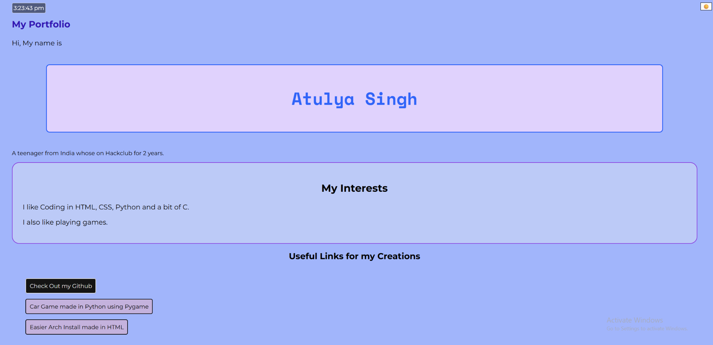

# My Portfolio

It's a website which tells about myself and the projects I made. I made this because I was actually inspired from others' portfollios and i wanted to make my own.

## Description

It's a portfolio made in HTML, CSS and JavaScript. It has a theme switcher and shows time in the corner. Uses Plain Background Color. does not use white and black for themes so that it looks cleaner. It also has custom cursor, I went with a crosshair type cursor because i thought it would be good.

### Screenshots

## Getting Started

### Dependencies

Any normal Browser capable of running full modern HTML, CSS and JavaScript,

### Executing program

Just open the link and it will run. no external programs required.

## License

This project is licensed under the MIT License - see the LICENSE file for details
